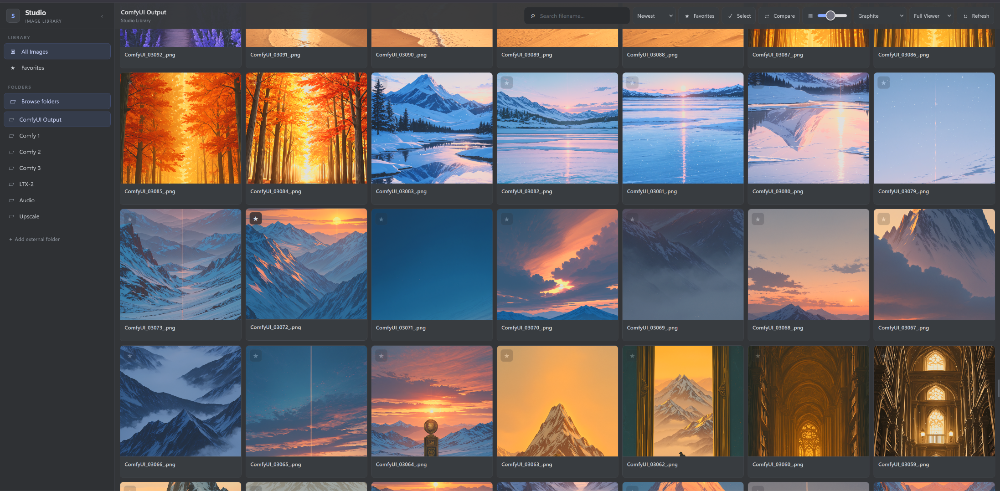
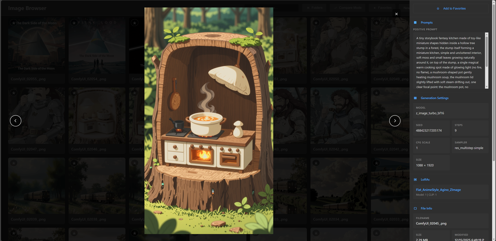

# ComfyUI Image Browser

## Description :mag:
A custom ComfyUI image browser with search, favorites, metadata inspection, and media support. Built to make browsing outputs fast and visual, with a full-screen viewer and compare mode.

## Screenshots :camera:

## Features :sparkles:
- Gallery view for images, videos, and audio files
- Search by filename
- Favorites system with filter
- Fullscreen modal preview with keyboard navigation
- Compare mode with slider (pick two images)
- Metadata panel (prompts, settings, LoRAs, raw metadata, file info)
- Folder manager (add/remove external folders, filter by folder/all)
- Video/audio indicators with inline playback

## Changelog :memo:
- See `CHANGELOG.md` for release history.

## Download :arrow_down:
Option 1 (ZIP):
1. Click **Code ? Download ZIP** on GitHub.
2. Extract the ZIP.

Option 2 (git):
1. `git clone https://github.com/Flibens/comfyui-image-browser`

## Install :wrench:
1. Copy this folder into your ComfyUI `custom_nodes` directory.
2. Restart ComfyUI.

## Use :arrow_forward:
In ComfyUI, click the **Image Browser** button in the top menu bar.

 ## Notes :arrow_forward:If you have problems viewing metadata, use a different save image node, i would recommend Lora Manager´s Save Image node.

